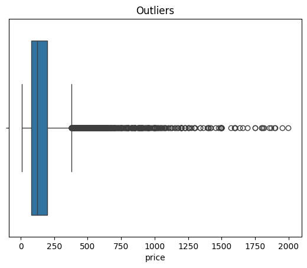
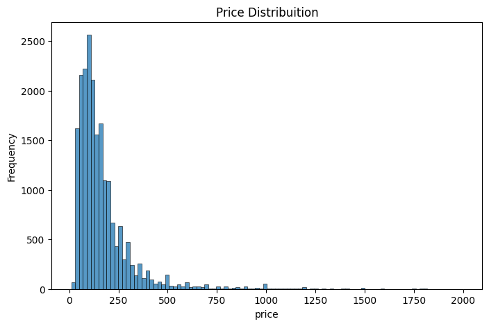
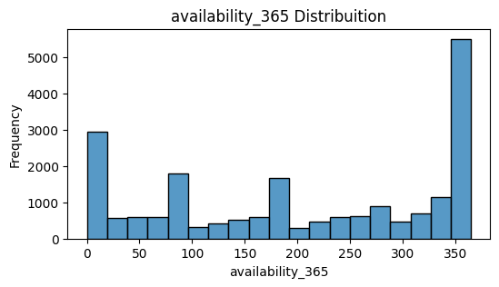
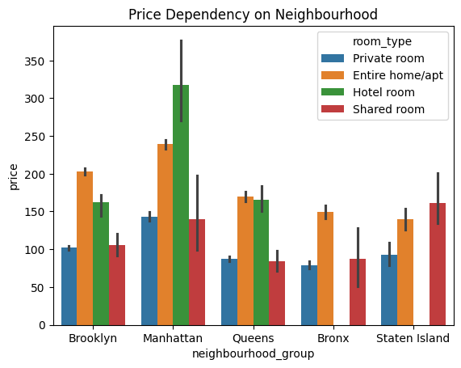
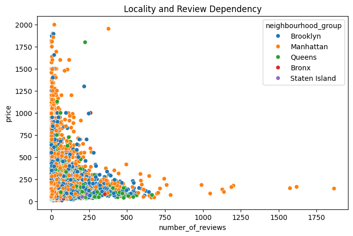
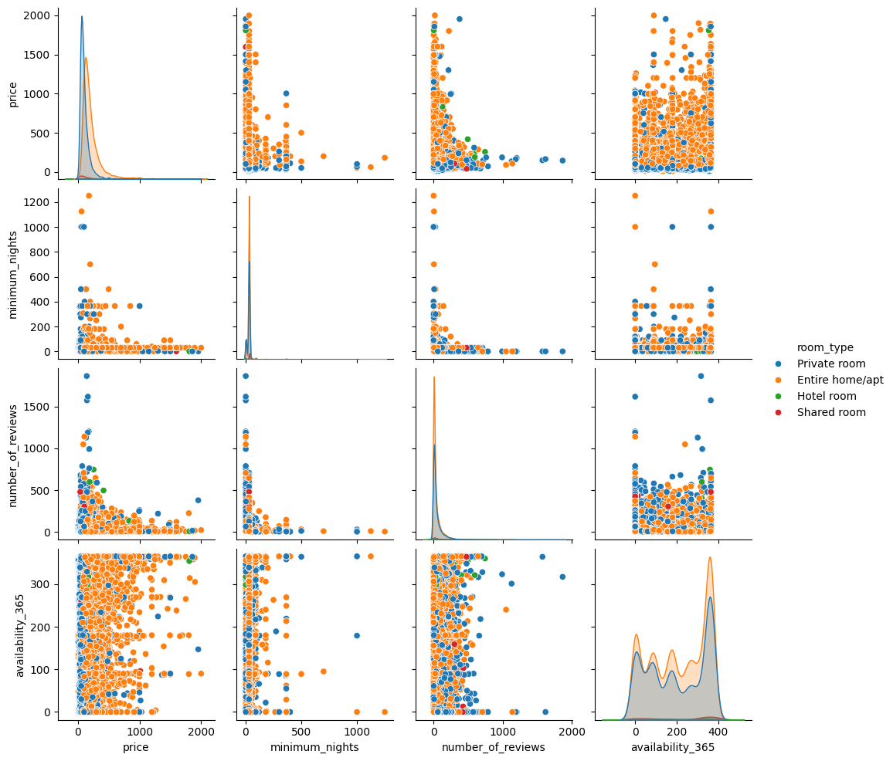
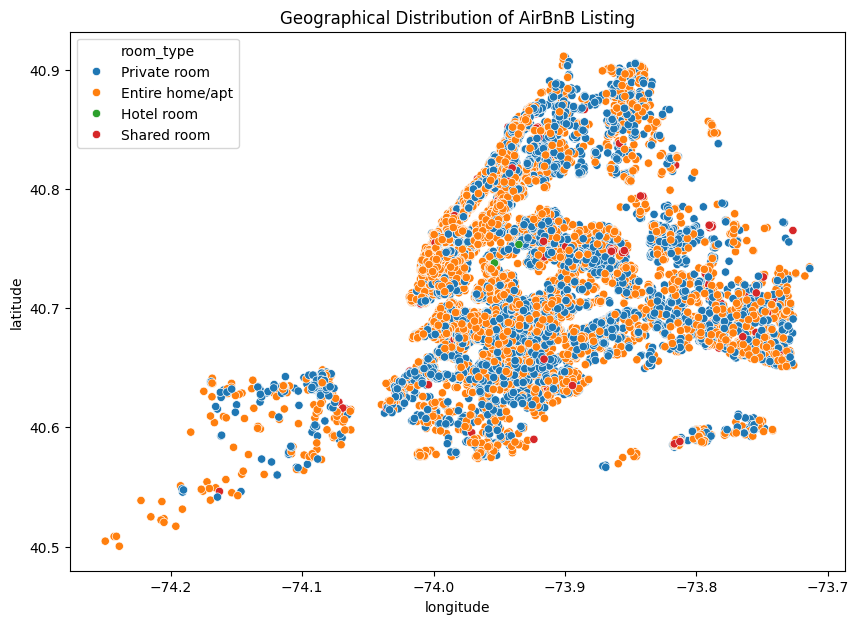
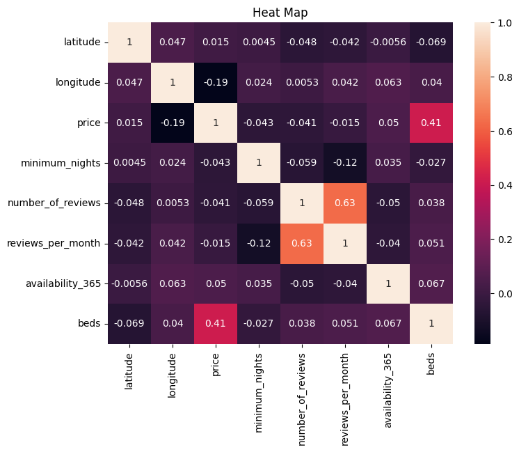

# 🏙️ Airbnb New York 2024 - Market Insights & Trends

New York City, the city that never sleeps, is also a top Airbnb
destination, attracting millions of visitors each year. Understanding
trends in pricing, availability, and customer preferences is crucial for
both hosts and investors looking to optimize their revenue potential.

Through data analysis and visual storytelling, this report uncovers key
insights into pricing strategies, popular neighborhoods, property
characteristics, and guest behavior in the 2024 Airbnb market.

## 📊 Dataset Data Types Summary

The dataset contains a mix of numerical and categorical data types.
Below is a summary of the key columns and their respective data types:

| Column Name                    | Data Type |
|:-------------------------------|:----------|
| id                             | float64   |
| name                           | object    |
| host_id                        | int64     |
| host_name                      | object    |
| neighbourhood_group            | object    |
| neighbourhood                  | object    |
| latitude                       | float64   |
| longitude                      | float64   |
| room_type                      | object    |
| price                          | float64   |
| minimum_nights                 | float64   |
| number_of_reviews              | float64   |
| last_review                    | object    |
| reviews_per_month              | float64   |
| calculated_host_listings_count | float64   |
| availability_365               | float64   |
| number_of_reviews_ltm          | float64   |
| license                        | object    |
| rating                         | object    |
| bedrooms                       | object    |
| beds                           | int64     |
| baths                          | object    |

## Problem Statement: Airbnb NYC 2024 Analysis

- **Objective:** Analyze pricing, availability, and guest behavior in
  the NYC Airbnb market.

- **Challenges:**

  - **Pricing Strategy:** Identify competitive yet profitable pricing
    trends.

  - **Market Trends:** Analyze borough-wise demand and availability
    patterns.

  - **Guest Preferences:** Understand the impact of reviews, ratings,
    and room types.

  - **Outlier Detection:** Detect extreme pricing and ensure regulatory
    compliance.

- **Expected Insights:**

  - Optimal pricing strategies for hosts.

  - Profitable boroughs for investors.

  - Booking recommendations for travelers.

  - Data-driven foundation for future predictive models.

## 🔍 Data Cleaning & Preprocessing

Before diving into insights, the dataset underwent rigorous cleaning to
ensure accuracy and consistency.

- **Missing values** were addressed in key columns such as price,
  reviews_per_month, and availability_365.

- **Data types** were corrected for rating, bedrooms, and baths.

- **Duplicate listings** were removed to maintain data integrity.

- **Outliers** (prices above \$1,000) were analyzed separately to avoid
  skewing trends.

## 💡 Exploratory Data Analysis (EDA)

### **Univariate Analysis: Outlier Analysis**

- **Most listings** are priced below **\$500**, with a few luxury
  properties reaching **\$2,000**.

- **Outliers** (prices above **\$1,000**) are rare but impact the
  overall distribution.

- **Luxury listings** in prime areas like **Manhattan** contribute to
  high-price extremes.

- **Hosts** should price competitively within **\$50 - \$500** for
  better bookings.

- **High-end properties** should justify pricing with premium amenities.

- **Outliers were analyzed separately** to prevent skewing market
  insights.

### Price Distribution

- **Majority of listings are priced below \$500, with a peak between
  \$50 - \$200.**

- **Luxury listings drive a right-skewed distribution, with some
  exceeding \$1,000.**

- **Most common price range suggests affordability for budget
  travelers.**

- **Hosts should optimize pricing within this range for maximum
  bookings.**

### Availability Distribution

- **Many listings have low availability, with peaks at 0 and 365 days.**

- **Listings with 0 availability may indicate inactive or seasonal
  rentals.**

- **Year-round availability (365 days) is common among full-time Airbnb
  hosts.**

- **Hosts with flexible availability can attract more bookings by
  optimizing open dates.**

- **Travelers should check availability patterns to find reliable
  listings.**

## 🛠️ Crafting Smart Insights: Feature Engineering

## Average Price by Room Type

- Calculates affordability **by dividing total price by the number of
  beds.**

- Groups listings by borough **to find the** average price per bed **in
  each area.**

- Helps hosts **set competitive prices based on borough trends.**

- Assists travelers **in finding budget-friendly stays by comparing
  per-bed costs.**

- Luxury areas (e.g., Manhattan) **tend to have a** higher price per bed
  **than budget-friendly areas like** Queens or the Bronx**.**

- **Manhattan has the highest per-bed cost, while Staten Island offers
  the most budget-friendly options.**

| Borough       | Average Price Per Bed (\$) |
|:--------------|:---------------------------|
| Manhattan     | 140.49                     |
| Brooklyn      | 100.07                     |
| Queens        | 76.80                      |
| Bronx         | 74.71                      |
| Staten Island | 67.73                      |

## 🔄 Exploring Relationships: Bi-Variable Analysis

## Price Dependency on Neighborhood & Room Type

- **Price varies significantly across boroughs, with Manhattan having
  the highest average prices.**

- **Room type impacts pricing—Entire homes/apartments are the most
  expensive, while shared rooms are the cheapest.**

- **Brooklyn offers a mid-range pricing, making it a balance between
  affordability and accessibility.**

- **Queens, Bronx, and Staten Island have lower prices, catering to
  budget travelers.**

- **Hosts in premium locations (Manhattan, Brooklyn) can leverage demand
  for high-end stays.**

### 

**Relationship Between Number of Reviews & Price**

- **No strong correlation between the number of reviews and
  price—listings with higher prices don’t always have more reviews.**

- **Lower-priced listings tend to have more reviews, indicating higher
  booking frequency.**

- **Luxury stays in Manhattan & Brooklyn have fewer but more exclusive
  reviews.**

- **Budget-friendly listings in Queens, Bronx, and Staten Island get
  more frequent reviews due to higher turnover.**

- **Hosts should focus on providing a great guest experience to increase
  reviews, boosting credibility and bookings.**

### 

### Multi-Feature Insights: Understanding Price, Nights, Reviews & Availability

- **No clear linear relationship between price and the number of
  reviews - cheaper listings tend to receive more reviews.**

- **Minimum nights vary widely, with some listings requiring extended
  stays, especially in entire homes/apartments.**

- **Availability trends show that some listings are open year-round (365
  days), while others are seasonal.**

- **Room type plays a role - private rooms and shared spaces often have
  lower prices and higher availability.**

- **Hosts can optimize listings by balancing price, availability, and
  minimum stay requirements for better bookings.**

### Mapping the Market: Geographical Distribution of Airbnb Listings

- **Manhattan and Brooklyn have the highest concentration of Airbnb
  listings.**

- **Listings are densely packed in central areas, particularly near
  tourist hotspots.**

- **Entire homes/apartments dominate in prime locations, while private
  rooms and shared spaces are more spread out.**

- **Queens and Bronx have fewer listings, often in residential zones
  catering to budget travelers.**

- **Staten Island has the least number of listings, indicating lower
  Airbnb activity.**

- **Hosts should consider location trends—proximity to transport and
  attractions boosts demand.**

**📈 Correlation Analysis**

**Heatmap Insights**

- **Price has weak correlations with most other variables, suggesting
  pricing is influenced by multiple factors beyond numerical
  attributes.**

- **Beds and Price show a positive correlation—larger listings tend to
  be more expensive.**

- **Number of reviews and reviews per month are strongly correlated,
  indicating that frequently booked listings receive more reviews.**

- **Availability_365 and minimum nights show little correlation, meaning
  listings with longer stay requirements don’t necessarily have lower
  availability.**

- **Latitude and Longitude have no significant correlation with price,
  implying that location-based pricing depends on boroughs rather than
  raw coordinates.**

- **Hosts should optimize pricing based on demand factors rather than
  just physical attributes.**

## 

## 📢 Key Market Insights & Business Strategies

- **Price is weakly correlated with most variables, indicating that
  multiple external factors (such as demand, location appeal, and
  seasonality) influence pricing.**

- **Listings with more beds tend to be more expensive, making larger
  properties more suitable for premium stays.**

- **Highly reviewed listings receive consistent monthly reviews,
  suggesting guest satisfaction drives repeat feedback.**

- **Availability does not strongly impact pricing, indicating that
  strategic pricing matters more than just keeping a listing open
  year-round.**

- **Location coordinates alone do not determine pricing, meaning
  borough-based demand and amenities play a bigger role in value
  perception.**

**📌 Recommendations**

**For Hosts:**

- Optimize pricing **based on demand, rather than simply increasing
  prices for larger properties.**

- Encourage guest reviews **to boost listing visibility and
  credibility.**

- Focus on competitive advantages **like amenities and location rather
  than just availability.**

- For high-demand areas (e.g., Manhattan), leverage premium pricing**,
  while in budget-friendly areas (e.g., Bronx, Staten Island),
  competitive pricing strategies work bes**t.

**For Investors:**

- **Manhattan and Brooklyn remain the most profitable areas,
  particularly for entire homes/apartments.**

- **Queens and the Bronx offer affordable investment opportunities with
  steady demand from budget-conscious travelers.**

- **High-bed listings attract premium pricing, making multi-room
  investments viable for long-term growth.**

**For Guests:**

- Private rooms in Brooklyn and Queens **offer a balance between price
  and location.**

- Listings with more reviews **are generally more reliable and have
  higher guest satisfaction.**

- Avoid extreme pricing outliers **unless they offer exceptional
  amenities or unique experiences.**

**🏁 Conclusion**

This Airbnb NYC 2024 Market Analysis highlights key pricing trends,
guest preferences, and market patterns across boroughs. The findings
emphasize that:

- **Pricing is driven by more than just physical features—location,
  demand, and guest experience matter.**

- **Hosts should prioritize reviews, strategic availability, and
  competitive pricing for success.**

- **Investors can maximize returns by understanding borough-based
  pricing trends and choosing properties wisely.**

- **Travelers should make informed decisions based on affordability,
  location, and guest feedback.**

By leveraging data-driven insights, hosts, investors, and travelers can
navigate the NYC Airbnb market efficiently for maximum profitability and
guest satisfaction.
